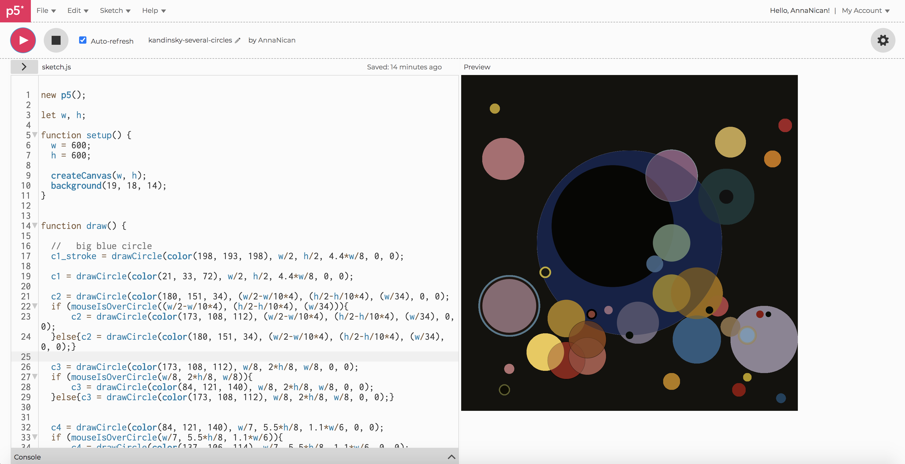

# p5.js-experiments

Before 2020, if I found myself on Upper East Side in between meetings, events, or weekend tumult, I would frequently dash to Guggenheim Museum to stare at some of my favorites from their core collection. For a while, my favorite was Henri Rousseau, but in recent years they have moved him back into storage (or it may be on-loan somewhere). My new favorite piece by Vasily Kandinsky is cosmic and harmonious [Several Circles](https://www.guggenheim.org/artwork/1992)). The pictures don’t do it justice- in person (from what I can remember), the painting is gigantic and absorbing. It’s dark canvas like a black hole of Guggenheims’ permanent collection room, soaks tourist traffic. Few will pass by without stopping for at least a couple of minutes in front of it. 
I miss Guggenheim, and I miss Kandinsky, so this week as part of NYU ITP camp experience I have decided to practice my p5.js by re-creating Kandinsky. I found the tedious work of recalculating positions on the canvas meditative. Coloring it yet again made me realize that sometimes simplistic expressionistic paintings require more through-trough color palettes and compositions that might seem from the first glance.  300 lines of code later, here is the experiment: (It’s animated, so make sure to hover over).

